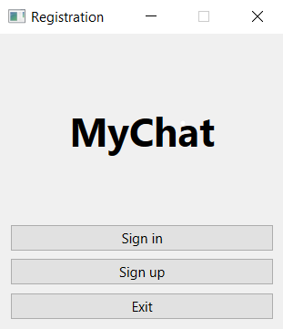
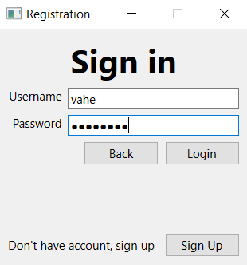
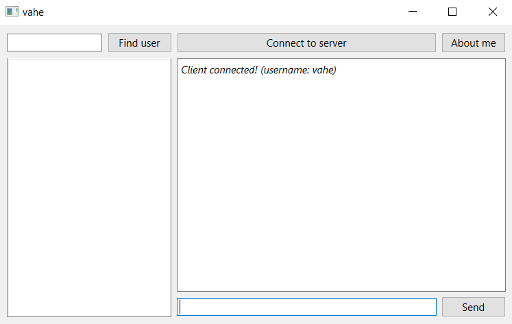
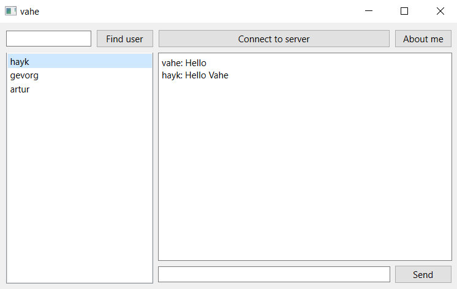

# Chat Application (Qt C++)

This is a real-time chat application built using Qt and C++ for both client and server sides. It uses SQLite as the database for user authentication and JSON files for data exchange between the client and server.

## Features

- **User Authentication**: Users can register and log in securely with SQLite database integration.
- **Real-Time Messaging**: Messages are sent and received instantly using TCP sockets.
- **Message History**: View past messages, even after restarting the application.
- **Modern GUI**: Built with Qt for a responsive and user-friendly interface.
- **Server-Client Architecture**: Communication is handled through QTcpServer and QTcpSocket.
- **JSON-based Messaging**: Data is exchanged in JSON format for scalability and ease of processing.

## Prerequisites

- **Qt 5.15+** (or later version)
- **SQLite** (bundled with Qt)

## Installation

1. **Clone the repository**:
   ```bash
   git clone https://github.com/yourusername/chat-application.git
   cd chat-application

**Build and Run the Server:**
- *Open the server.pro file in Qt Creator.*
- *Build and run the server project first.*

**Build and Run the Client:**
- *Open the client.pro file in Qt Creator.*
- *Build and run the client project.*

## Usage
1. **Start the Server:** Run the server project to initialize the QTcpServer.
2. **Connect Clients:** Launch the client application, log in, and connect to the server.
3. **Send Messages:** Messages are sent and received instantly using JSON files for data exchange.
4. **Chat History:** All messages persist locally in the SQLite database.

## Database Details
- **SQLite database and tables are created dynamically when the application runs for the first time.**
- **Authentication and message logs are stored in the database.**


## Chat Application Screenshot
### Registration:

### Sign up:

### Sign in

### Chat window

### Message history

